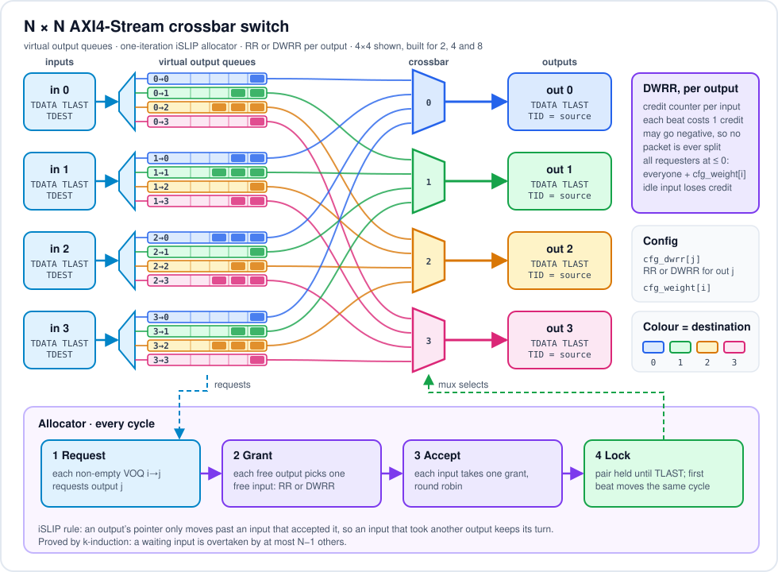

# AXI4-Stream Crossbar Switch

An N x N packet switch in SystemVerilog with virtual output queues, an
iSLIP-style allocator, and per-output round-robin or deficit-weighted
round-robin (DWRR) arbitration. Ports are AXI4-Stream. I tested it with 2, 4
and 8 ports.

I built it to understand the classic switch-design trade-offs by measuring
them myself: head-of-line blocking, allocator fairness, and what QoS
weighting actually delivers. I also wanted to prove the important properties
formally rather than just simulate them.

## Summary

- Virtual output queues, so a packet waiting for a busy output never blocks
  packets behind it that are headed elsewhere
- One-iteration iSLIP-style separable allocator; consecutive packets go out
  back to back with no idle cycle
- Round robin or DWRR, chosen per output, with programmable per-input weights
- 30-run regression: 2.5 million packets delivered intact, in order and never
  interleaved
- Under saturated uniform traffic, 99 % throughput with VOQs against 65.5 %
  with plain input FIFOs, which is the textbook head-of-line limit for a 4x4
  switch
- DWRR with weights 1:2:3:4 measured at exactly 10 / 20 / 30 / 40 %
- Formal proofs (SymbiYosys, k-induction): an input feeds at most one output,
  packets are never interleaved, outputs follow AXI4-Stream rules, FIFOs never
  overflow, and a waiting input is overtaken by at most N-1 others
- Artix-7: 94 MHz for 4x4, 66 MHz for 8x8

## Design

<p align="center">
  
</p>

**Ports.** Standard AXI4-Stream: `TVALID`/`TREADY`, `TDATA`, `TLAST` marks
the end of a packet, and `TDEST` on the first beat picks the output. On the
output side, `TID` tells the receiver which input the packet came from.
`cfg_dwrr[j]` selects the arbitration mode of output j, and `cfg_weight[i]`
sets input i's DWRR weight (0 is treated as 1).

**Virtual output queues.** Every input has one small FIFO per output. I also
kept a `VOQ = 0` build that uses a single FIFO per input with the same total
storage, so I could measure what head-of-line blocking costs instead of just
quoting the number.

**Allocation, every cycle:**

1. each free output picks one free input that has a packet for it
2. each free input that got picked by more than one output accepts one of
   them, round robin
3. the pair is locked until `TLAST`, and the first beat moves in the same
   cycle, so there is no bubble between packets

An output's round-robin pointer only moves past an input if that input
accepted. This is the iSLIP rule. An input that was offered an output but
took a different one keeps its turn, which is what prevents starvation. The
formal proof shows the rule matters (see "pointer_on_grant" below).

**DWRR.** Each input has a credit counter at each output. Only inputs with
credit above zero can be granted, and every beat sent costs one credit. A
packet is allowed to go negative, because cutting a packet in half isn't an
option. When none of the requesting inputs has credit left, everyone gets
`cfg_weight` more. An input whose queue empties loses its credit, like
classic DRR, so an idle input can't save up bandwidth. Credits are charged a
cycle after the beat moves, for timing reasons (below); the shares are a
long-run average, so the lag doesn't change them.

## Verification

### Simulation

Every beat carries `{source, packet number, beat number}` in its data. That
lets the scoreboard check each delivered packet precisely: it went to the
right output, `TID` matches the source, all beats arrived in order with
`TLAST` on the last one, packets from one source to one output stayed in
order, nothing was interleaved, and nothing was lost or made up.

The testbench runs three phases:

- **functional:** random destinations, packet lengths 1 to 8, random idle
  gaps, random backpressure on every output (100 %, 70 % and 25 % ready), and
  a random mix of RR and DWRR outputs with random weights
- **throughput:** every input always has a packet waiting, uniform random
  destinations, 1-beat packets, no backpressure
- **fairness:** every input floods output 0, measured under RR and then DWRR
  with weights 1:2:3:4

The regression covers N = 2, 4 and 8, the VOQ and FIFO builds, and three
seeds each, plus a queue-depth sweep:

```
REGRESSION PASSED (30 runs)
2,544,438 packets / 3,559,938 beats delivered intact, in order, never interleaved
```

### Formal

A 3x3 switch with every input left free, so any traffic and any
configuration change is allowed:

| | property | result |
|---|---|---|
| F1 | an input feeds at most one output in any cycle | proved |
| F2 | after a beat that isn't the last, the output stays locked to the same input | proved |
| F3 | outputs follow AXI4-Stream: the beat and `TVALID` hold while `TREADY` is low | proved |
| F4 | while input i0 is free and has a packet for round-robin output j0, at most N-1 other inputs are matched to j0 before it (i0 and j0 are picked by the solver, so this covers every pair) | proved |
| F5 | no queue is pushed when full or popped when empty | proved |

Both builds are proved. F4 needed an inductive invariant: (losses so far) +
(distance from j0's pointer to i0) ≤ N-1. That holds because every match that
overtakes i0 moves j0's pointer strictly closer to it. A cover trace reaches
exactly N-1 losses, so the bound is tight.

I also checked that the proof can fail, by putting bugs back in one at a time
(`make mutants`):

```
input_in_two_matches   (allocator ignores whether an input is busy)   caught
release_before_tlast   (unlock after any beat)                        caught
lock_only_on_transfer  (no lock while TREADY is low)                  caught
pointer_on_grant       (move the pointer on grant, not on accept)     caught
pointer_never_moves                                                   caught
push_ignores_full      (TREADY always high)                           caught
```

`pointer_on_grant` is the one I find most interesting. It is exactly the
difference between iSLIP and a naive separable allocator. Every other test
passes with it, and only the starvation property notices.

### Bugs I hit

1. **Signed and unsigned in DWRR.** Adding the unsigned weight to the signed
   credit made the whole sum unsigned, so a negative credit turned into a huge
   positive one. Inputs that had overdrawn got rewarded instead of charged,
   and the weight-1 input ended up with 74 % of the bandwidth. The fairness
   test caught it.
2. **A FIFO depth that wasn't a power of two.** In the 3-port proof, the
   single-FIFO build sized its queue N x DEPTH = 6. My pointer arithmetic
   assumes a power of two, so the queue quietly overflowed. Formal found it
   with a 6-cycle trace. The FIFO now refuses to elaborate unless the depth is
   a power of two.
3. **A wrong assertion.** `(wp - rp) <= DEPTH` evaluated the subtraction at 32
   bits because of the integer `DEPTH`, so wrapped pointers looked like a huge
   count. That was a bug in the checker, not the design.
4. **A static string in the testbench.** `string line = ""` inside a loop in
   an `initial` block is only initialised once, so the second results line
   repeated the first.

## Results

### Head-of-line blocking (4x4, saturated uniform traffic, 1-beat packets)

| queue depth | 2 | 8 | 16 | 32 | 64 | 128 |
|---|---|---|---|---|---|---|
| one FIFO per input | 65.5 % | 65.3 % | 65.3 % | 65.2 % | 65.5 % | 65.5 % |
| VOQ + iSLIP | 68.3 % | 84.4 % | 90.7 % | 94.1 % | 97.1 % | 99.0 % |

The FIFO switch stays at the head-of-line limit (65.5 % for four ports,
heading towards 58.6 % for large N) however much buffering it has. The VOQ
switch gets closer to 100 % as the queues get deeper. Saturated traffic has
no slack at all, which is why it needs deep queues to get there.

### QoS: four inputs flooding one output

| | in 0 | in 1 | in 2 | in 3 |
|---|---|---|---|---|
| round robin | 25.1 % | 25.1 % | 24.6 % | 25.2 % |
| DWRR, weights 1:2:3:4 | 10.0 % | 20.0 % | 30.0 % | 40.0 % |

### FPGA (Vivado 2021.1, Artix-7 xc7a100tcsg324-1, out-of-context)

| configuration | Fmax | LUT | FF | LUTRAM |
|---|---|---|---|---|
| 4x4, VOQ, depth 4 | 94 MHz | 1,131 | 268 | 864 |
| 4x4, single FIFO | 91 MHz | 1,132 | 204 | 216 |
| 8x8, VOQ, depth 4 | 66 MHz | 5,597 | 1,016 | 3,456 |

How the timing got there:

| change | 4x4 | 8x8 | critical path |
|---|---|---|---|
| first version | 86 MHz | 27 MHz | locks, allocation, transfer, then the DWRR credit update (37 logic levels at 8x8) |
| charge DWRR credits one cycle later | 97 MHz | 28 MHz | locks, allocation, transfer, queue pop |
| round robin written as a masked priority pick (`x & (~x + 1)`) instead of a search loop | 94 MHz | 66 MHz | 15 logic levels at 8x8 |

The search loop meant the same thing as the masked pick, but it synthesised
into a ripple chain that grows with N. What's left on the critical path is the
cost of zero-bubble packets: lock state, allocation, first beat and queue pop
all in one cycle. The next step would be a pipelined allocator, either paying
one idle cycle per packet or allocating the next packet while the current
one is still going out.

## Running it

Linux or WSL with the YosysHQ OSS CAD Suite:

```
make lint        # Verilator -Wall: N = 2, 4, 8, VOQ and FIFO
make sim         # one run (N=4 VOQ=1 SEED=1 DEPTH=4)
make regress     # 30 runs plus the depth sweep
make formal      # both proofs and cover
make mutants     # check that the proof catches each inserted bug
```

Vivado (Windows):

```
vivado -mode batch -source syn\vivado_impl.tcl -tclargs 4 1 4.0     # N, VOQ, period in ns
```

## Files

```
rtl/      xb_fifo.sv  xb_switch.sv
tb/       tb_xb.sv  xb_props.sv
formal/   xb_switch.sby  xb_formal_top.sv  results/
syn/      vivado_impl.tcl  reports/
scripts/  lint, sim, regress, formal, mutants
docs/     img/  architecture diagram (SVG)
```

## Limitations

- The ports use valid/ready flow control only; there is no credit-based link
  flow control.
- One iSLIP iteration. More iterations would help with small buffers, at the
  cost of a longer allocation path.
- The input accept side is round robin, but I haven't proved its fairness
  formally. An input that keeps getting matched to other outputs is being
  served, not starved, and a full liveness proof would need fairness
  assumptions on `TREADY`.

Vineet Chadalavada
